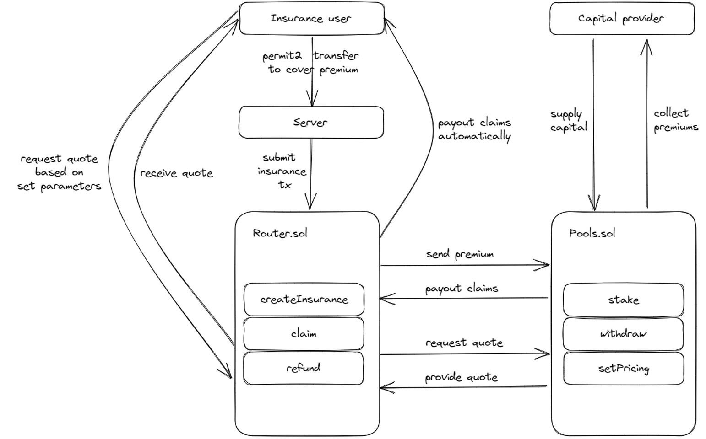

# Ultravity Insurance
Transaction based insurance built on top of [Ultravity](https://www.ultravity.co/).

Ultravity Insure is a next generation decentralized insurance protocol, enabling the protection of single transactions.
Using the Ultravity risk score, users can insure single transactions based on the simulation outcome. If the insured transaction has any deviations compared to the simulated outcome, users get their insurance cover paid out instantly. Capital is provided by permissionless vaults where users can stake WBIT to collect insurance premiums. Stakers can choose between multiple pools with distinct risks/return characteristics.

# Deployed contracts
Our contracts are deployed on the Mantle testnet:
| Contract   | Deployment Address |
|------------|--------------------|
| Router.sol |      [0xebE4C3052624a9909b1F5E8EAD080155dcDffdb1](https://explorer.testnet.mantle.xyz/address/0xebE4C3052624a9909b1F5E8EAD080155dcDffdb1)              |
| Pools.sol  |       [0x71C2468664b8c0c7d0ad0eA59C1fc1ddA15CDA7c](https://explorer.testnet.mantle.xyz/address/0x71C2468664b8c0c7d0ad0eA59C1fc1ddA15CDA7c)                  |

# Demo
Staking page under https://insure.ultravity.co/ 

Insurance page under https://insure.ultravity.co/insure 

Chrome extension available [here](https://drive.google.com/file/d/1UTjqJnB62GFmgRR9pAzhbGYkBtRgvjeV/view?usp=sharing) - the extension was not built during this hackathon
    
    To install:
    1. Settings - icon > Tools > Extensions

    2. Enable Developer Mode (toggle button in top-right corner)

    3. Drag and drop the '.crx' extension file onto the Extensions page

    4. Install

Demo video is uploaded [here](https://drive.google.com/file/d/1Yxt58QowXSta5voAx6YSnOyzZ777bGRg/view?usp=share_link)

Presentation uploaded [here](https://drive.google.com/file/d/1vojIBhNzOmZnFnuhOZglM05PFxYrZKiP/view?usp=share_link)

# Demo transactions
Insurance transaction: [0x0fd8a17390ba4b5a3d34eaf8014234ace1161af9c7245db3c027895d19171a7a](https://explorer.testnet.mantle.xyz/tx/0x0fd8a17390ba4b5a3d34eaf8014234ace1161af9c7245db3c027895d19171a7a)

Insured transaction: [0x695fb0ae6fcb4467b7c88357445c61c4adcd0b64340e360f7d5a0e2e6a07bae1](https://explorer.testnet.mantle.xyz/tx/0x695fb0ae6fcb4467b7c88357445c61c4adcd0b64340e360f7d5a0e2e6a07bae1)

Insurance payout transaction: [0x47d199eb4f341ea134e662abfdddceccaf8824d145c842815dd37031027720df](https://explorer.testnet.mantle.xyz/tx/0x47d199eb4f341ea134e662abfdddceccaf8824d145c842815dd37031027720df)

# Architecture
